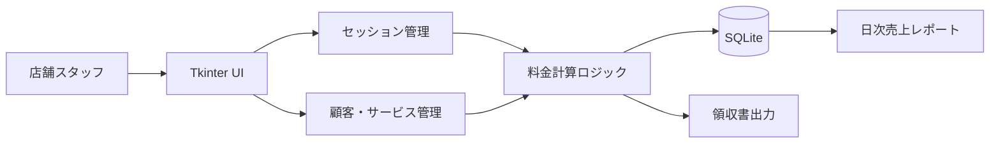
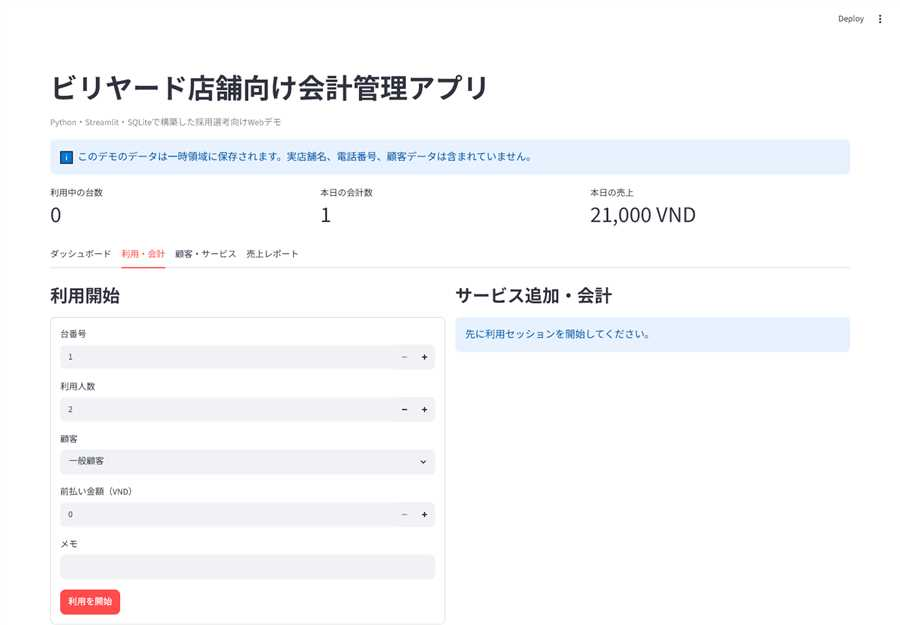

# ビリヤード店舗向け会計管理アプリ

[](https://github.com/23610252hoang/billiards-billing-manager/actions/workflows/python-app.yml)

[](https://share.streamlit.io/deploy?repository=23610252hoang/billiards-billing-manager&branch=main&mainModule=streamlit_app.py)

ビリヤード店舗の受付・会計業務を想定して作成したデスクトップアプリです。台の利用開始・終了、プレイ時間に応じた料金計算、サービス追加、顧客管理、領収書出力、日次売上確認までをローカル環境で扱えるようにしました。

過去に作成したローカル実行ファイルをもとに、採用選考で確認しやすいようにソースコードを整理し直したポートフォリオ版です。実店舗名、電話番号、実データ、生成済みレポートなどの個人情報・業務情報は含めていません。

## 10秒で分かる概要

| 項目 | 内容 |
| --- | --- |
| 対象ユーザー | 小規模ビリヤード店舗の受付・会計担当者 |
| 解決する課題 | 利用時間・追加注文・前払い・割引を手作業で管理する負担とミス |
| 主な機能 | 台管理、自動料金計算、サービス追加、顧客管理、領収書、日次売上 |
| 技術 | Python, Tkinter, SQLite |
| 実行環境 | Windows / ローカル完結 |

## 開発背景・完成までの流れ

1. 店舗業務を「利用開始」「利用中」「会計」「売上確認」に分解しました。
2. セッション、顧客、サービス、設定をSQLiteのテーブルとして設計しました。
3. スタッフが日常的に使う操作をTkinterのタブUIにまとめました。
4. 利用時間・単価・追加サービス・割引・前払いから最終金額を計算するロジックを実装しました。
5. 領収書出力、日次集計、スモークテストを追加しました。
6. GitHub公開用に、実店舗データと個人情報を除外しました。

## 主な機能

- 台ごとのセッション開始・終了管理
- 利用時間、時間単価、人数、前払い、割引をもとにした自動会計
- ドリンクなどの追加サービス登録と料金加算
- 顧客登録とポイント管理
- 領収書のテキスト出力
- SQLiteに保存した履歴から日次売上を集計
- ローカル完結型のデータ保存

## システム構成



## データ設計

| テーブル | 役割 |
| --- | --- |
| `sessions` | 台番号、開始・終了時刻、料金、サービス、支払情報を保存 |
| `customers` | 顧客名、電話番号、ポイントを管理 |
| `services` | ドリンク・キュー貸出などの名称と料金を管理 |
| `settings` | 台数、時間単価、ポイント基準を管理 |
| `reservations` | 予約情報を保存するための拡張用テーブル |
| `inventory` / `expenses` | 在庫・経費管理に向けた拡張用テーブル |

## 使用技術

- Python 3.10+
- Tkinter: デスクトップGUI
- SQLite: ローカルデータベース
- pathlib / dataclasses / json / datetime: 標準ライブラリによるデータ処理
- Git / GitHub: バージョン管理・成果物提出

## 課題と解決

| 課題 | 解決方法 | 設計上の意図 |
| --- | --- | --- |
| 同じ台で複数セッションが開始される | 開始前に利用中セッションをDBで確認 | 二重登録と二重会計を防ぐ |
| 料金計算条件が複数ある | 基本料金、サービス、割引、前払いを分けて計算 | 計算根拠を追いやすくする |
| 会計履歴を残したい | セッション終了時にDB更新と領収書出力を行う | 後から確認・集計できる |
| 実店舗データを公開できない | DB、領収書、実行ファイルをGit管理対象外にする | 個人情報・業務情報を保護 |
| 外部サーバーを用意できない | TkinterとSQLiteでローカル完結 | 小規模店舗で導入しやすくする |

## 業務的な価値

- 手計算による会計ミスを減らせます。
- 台ごとの利用状況を一覧で確認できます。
- 領収書出力により会計履歴を残せます。
- 日次売上をすぐ確認でき、店舗運営の振り返りに使えます。
- 小規模店舗でも導入しやすいローカル完結型です。

## Webデモ

Streamlit版では、ブラウザ上で以下の業務フローを確認できます。



- 台の利用開始
- サービス追加
- 割引・支払方法を含む会計
- 日本語領収書の表示・ダウンロード
- 顧客・サービス登録
- 日次売上と売上グラフ

ローカルでWebデモを実行する場合:

```bash
pip install -r requirements.txt
streamlit run streamlit_app.py
```

Streamlit Community Cloudへデプロイする場合は、main file pathに `streamlit_app.py` を指定します。

## デスクトップ版の実行方法

必要環境:

- Python 3.10以上
- Tkinterが利用できるデスクトップ環境

```bash
git clone https://github.com/23610252hoang/billiards-billing-manager.git
cd billiards-billing-manager
python run_app.py
```

実行すると、以下のローカルデータが自動作成されます。

- `data/billiards_app.db`
- `reports/`

これらの生成ファイルはGit管理対象外にしています。

## 動作確認

```bash
python -m compileall run_app.py src tests
python -c "import sys, runpy; sys.path.insert(0, 'src'); runpy.run_path('tests/smoke_test.py', run_name='__main__')"
```

スモークテストでは、以下を確認します。

- 顧客とサービスを登録できること
- セッションを開始できること
- サービスを会計へ追加できること
- 割引を含む最終金額を計算できること
- 日本語領収書を生成できること

## ディレクトリ構成

```text
src/billiards_manager/
  app.py       # Tkinter UIと業務操作
  database.py  # SQLiteスキーマとデータアクセス
  __main__.py  # アプリのエントリーポイント
tests/
  smoke_test.py
run_app.py     # ローカル実行用ランチャー
```

## 現在の制約

- 単一PC・単一店舗での利用を想定しています。
- 同時に複数端末から更新する構成ではありません。
- PDF領収書やプリンター連携は未実装です。
- 公開デモは一時データを使用し、永続保存・ユーザー認証には対応していません。

## 今後の改善

- 単体テストとUIテストの追加
- CSV/PDFレポート出力
- 在庫・予約・経費画面の実装
- 複数店舗・複数端末に対応するAPI化
- ロール別権限とログイン機能
- バックアップとデータ移行機能

## 面接で説明できるポイント

- 店舗業務をどのようにテーブル設計と画面操作へ変換したか
- ローカルアプリとしてTkinter・SQLiteを選んだ理由
- 二重セッションや個人情報公開をどう防いだか
- 現在の制約を踏まえ、Web/API構成へどう拡張するか

## 補足

旧版の実行ファイル、実データベース、生成済みレポートは公開していません。このリポジトリには、採用選考で確認していただくためのクリーンなソースコードのみを含めています。

