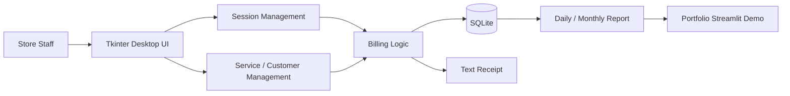

# Billiards Billing Manager

[](https://github.com/23610252hoang/billiards-billing-manager/actions/workflows/python-app.yml)
[](LICENSE)
[](https://23610252hoang-billiards-billing-manager-streamlit-app-jfvswo.streamlit.app/)

ビリヤード店舗の受付・会計業務を想定して作成した、Python製の料金管理アプリです。  
旧版は友人のビリヤード店舗で試用してもらい、実際の受付フロー、テーブル管理、サービス料金、レシート出力、月次売上確認の流れを確認しました。

このリポジトリは、公開用に個人情報・店舗識別情報・実データベースを除外し、面接・ポートフォリオ用に再構成した版です。  
実店舗名、住所、電話番号、顧客情報、元のExcel報告書は公開していません。

## Portfolio Summary

| 項目 | 内容 |
| --- | --- |
| 想定ユーザー | 小規模ビリヤード店舗の受付・会計担当者 |
| 解決したい課題 | テーブル利用時間、サービス注文、割引、会計、売上確認を手作業で管理する負担 |
| 旧版の検証 | 友人の店舗で実際の業務フローに近い形で試用 |
| 公開版 | StreamlitでWebデモ化し、個人情報を含まないデモデータで再構成 |
| 使用技術 | Python, Tkinter, Streamlit, SQLite, pandas, GitHub Actions |
| 面接で説明できる点 | 業務理解、DB設計、料金計算、レシート出力、売上集計、公開時の情報保護 |

## Evidence From Previous Local Version

旧版アプリの画面写真と、1か月分の売上報告をもとに、公開可能な範囲でケーススタディ化しました。  
以下の画像は、店舗名・住所・電話番号・顧客情報をマスクしたものです。


| 1か月分の匿名化集計 | 値 |
| --- | ---: |
| 取引行数 | 289 |
| 集計カウント列 | 512 |
| テーブル売上 | JPY 557,324 |
| サービス売上 | JPY 237,987 |
| 合計売上 | JPY 795,311 |
| 平均取引額 | JPY 2,752 |
| サービス売上比率 | 29.9% |

詳しい説明は [docs/CASE_STUDY_JA.md](docs/CASE_STUDY_JA.md) にまとめています。

## Legacy Screenshots

| 設定画面 | 仮会計 | レシート | サービス管理 |
| --- | --- | --- | --- |
|  |  |  |  |

## Main Features

- テーブルごとの利用開始・利用終了管理
- 利用時間と時間単価にもとづく料金計算
- ドリンクなどのサービス追加
- 割引・前払いを含む会計処理
- 顧客情報とポイント管理
- テキスト形式のレシート出力
- SQLiteに保存した履歴から日次売上を集計
- Streamlit版によるWebデモ表示
- GitHub Actionsによるスモークテスト

## Business Value

このアプリの価値は、単に会計画面を作ることではなく、店舗スタッフが日常的に行う作業を整理し、ミスを減らすことにあります。

- 会計金額の手計算ミスを減らす
- どのテーブルが利用中かすぐ確認できる
- サービス注文とテーブル料金をまとめて会計できる
- レシート形式で会計内容を残せる
- 1日の売上や1か月分の売上を振り返れる
- 将来的に混雑時間帯、客単価、サービス売上比率の分析に発展できる

実際の1か月分の匿名化集計では、サービス売上が全体の約29.9%を占めていました。  
このような数字を見ることで、単なる会計アプリから、店舗運営の改善に使えるデータ基盤へ発展できる可能性があると考えました。

## System Design



## Data Design

| Table | Role |
| --- | --- |
| `sessions` | table number, start/end time, play time, service amount, discount, final amount |
| `customers` | customer name and points for local shop operation |
| `services` | drink/snack/service menu and price |
| `settings` | table count, hourly rate, currency, night surcharge settings |
| `reservations` | extension point for reservations |
| `inventory` / `expenses` | extension point for stock and expense management |

## Source Code Explanation

面接では、以下の流れでソース説明できます。

1. `src/billiards_manager/app.py`  
   Tkinter版の画面、テーブル操作、会計操作を担当します。

2. `src/billiards_manager/database.py`  
   SQLiteの初期化、セッション保存、サービス保存、売上集計を担当します。

3. `streamlit_app.py`  
   GitHub上で見てもらいやすいように、公開用Webデモとして再構成した画面です。

4. `tests/smoke_test.py`  
   DB初期化、会計計算、デモデータ作成、日次集計が動くことを確認します。

## Web Demo

Streamlit版では、ブラウザ上で以下の業務フローを確認できます。


- 利用中テーブルの確認
- テーブル利用開始
- サービス追加
- 割引を含む会計
- 本日の売上確認
- 履歴テーブルの確認

Run locally:

```bash
pip install -r requirements.txt
streamlit run streamlit_app.py
```

## Desktop Version

旧版のローカルアプリは、TkinterとSQLiteで構成しています。

```bash
git clone https://github.com/23610252hoang/billiards-billing-manager.git
cd billiards-billing-manager
python run_app.py
```

実行すると、ローカルに以下の生成ファイルが作成されます。

- `data/billiards_app.db`
- `reports/`

これらは店舗データや生成レポートを含む可能性があるため、Git管理対象外にしています。

## Test

```bash
python -m compileall run_app.py src tests
python -c "import sys, runpy; sys.path.insert(0, 'src'); runpy.run_path('tests/smoke_test.py', run_name='__main__')"
```

スモークテストでは、以下を確認します。

- 顧客とサービスを登録できること
- セッションを開始できること
- サービス料金を会計に追加できること
- 割引を含む最終金額を計算できること
- 日本語レシートを生成できること
- デモデータと日次売上集計が動くこと

## What I Learned

- 実際の業務フローを画面とDB設計に落とし込むこと
- 料金計算の根拠をコード上で分かりやすく分けること
- ローカルアプリとWebデモでは必要な設計が異なること
- 公開ポートフォリオでは、実データを見せるよりも、匿名化・集計化して説明することが重要であること
- アプリ開発とデータ分析を組み合わせると、売上改善や運営改善につなげられること

## Current Limitations

- 公開版はデモ用途であり、実店舗データは保存していません。
- 複数端末から同時に使うためのAPI設計は未実装です。
- ログイン、権限管理、バックアップ、監査ログは今後の改善項目です。
- レシートプリンター連携は未実装です。

## Interview Talking Points

- 旧版は実店舗で試用してもらい、公開版では情報保護のために再構成したこと
- 料金計算、サービス追加、売上集計という業務の流れをコードに落とし込んだこと
- 1か月分の匿名化集計から、サービス売上比率など運営改善につながる指標を見られること
- 実務で使うなら、ログイン、権限管理、クラウドDB、バックアップ、レシートプリンター連携を追加したいこと

## Privacy Notice

このリポジトリには、実店舗の元データベース、元Excel報告書、住所、電話番号、顧客情報は含めていません。  
掲載している画像と数値は、面接・ポートフォリオ説明用に匿名化・集計化したものです。
