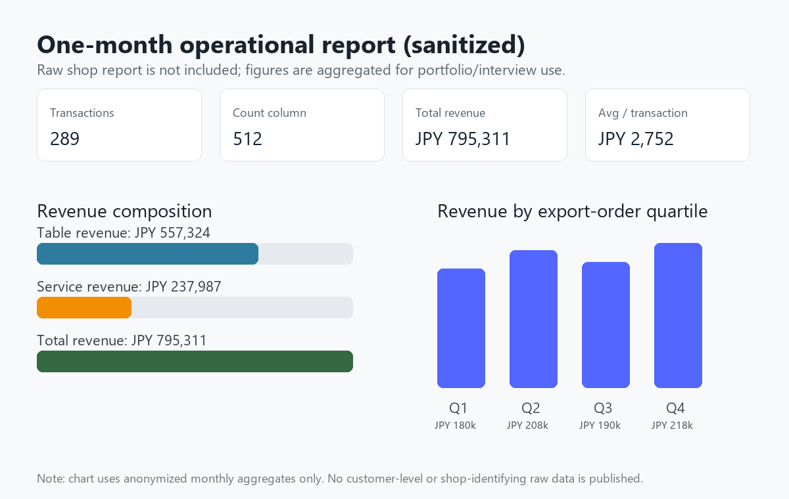
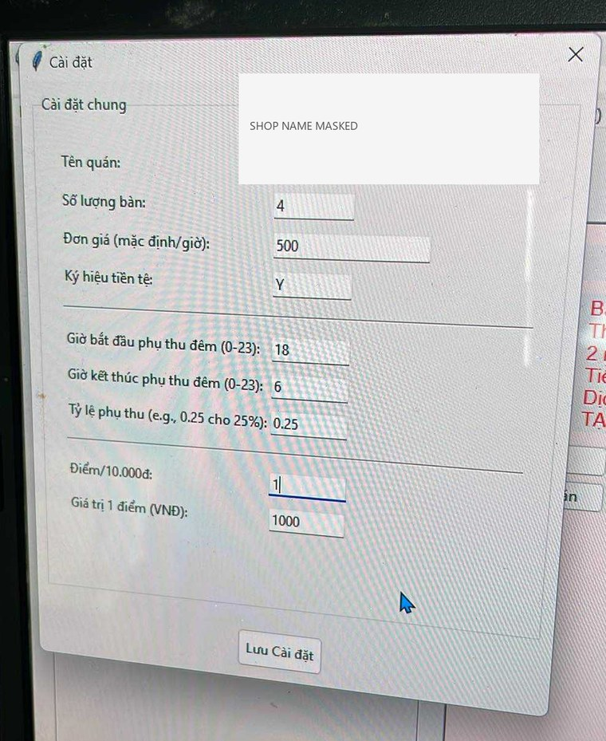
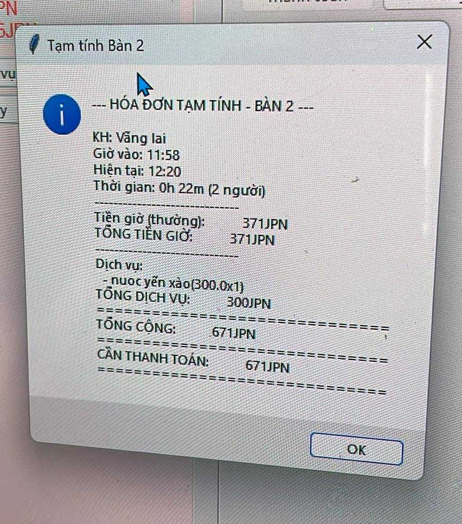
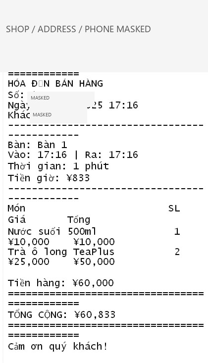
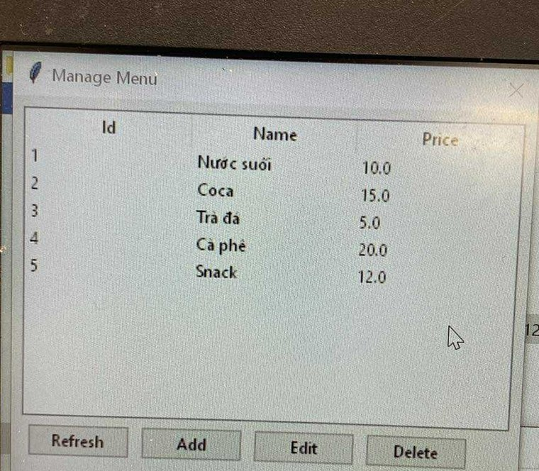

# Case Study: Billiards Billing Manager

## 1. 背景

このプロジェクトは、友人のビリヤード店舗で使うことを想定して作成した料金管理アプリです。  
最初は学習目的のアプリでしたが、実際の店舗業務に近い形で試用してもらうことで、受付・会計業務には以下のような課題があると分かりました。

- テーブルごとに開始時間と終了時間を管理する必要がある
- 人数、時間単価、夜間料金、サービス注文などで会計条件が変わる
- ドリンクや軽食などのサービス料金を追加する必要がある
- 会計内容をレシートとして残したい
- 日次・月次の売上を後から確認したい

このため、単なるタイマーではなく、テーブル管理、会計、サービス管理、売上確認までを一つの流れで扱えるアプリを目指しました。

## 2. 実店舗で確認した業務フロー

旧版では、以下の流れを想定して実装しました。

1. 店舗スタッフが空いているテーブルを選択する
2. 利用開始ボタンを押す
3. 利用中にドリンクなどのサービスを追加する
4. 会計時に利用時間とサービス料金を合算する
5. 必要に応じて割引や前払いを反映する
6. レシート形式で会計内容を確認する
7. 1日の売上や月次売上を確認する

この流れを確認したことで、画面上で「今どのテーブルが使われているか」がすぐ分かること、会計計算の根拠が分かることが重要だと学びました。

## 3. 匿名化した1か月分の集計

実店舗で取得した元Excel報告書は、店舗情報や業務情報を含む可能性があるため公開していません。  
代わりに、ポートフォリオ用として個人情報・店舗識別情報を除いた月次集計のみを掲載しています。

| 指標 | 値 |
| --- | ---: |
| 取引行数 | 289 |
| 集計カウント列 | 512 |
| テーブル売上 | JPY 557,324 |
| サービス売上 | JPY 237,987 |
| 合計売上 | JPY 795,311 |
| 平均取引額 | JPY 2,752 |
| サービス売上比率 | 29.9% |

この結果から、テーブル料金だけでなく、ドリンクや軽食などのサービス売上も店舗運営では重要であることが分かります。  
将来的には、時間帯別売上、曜日別売上、サービス売上比率、客単価の推移などを可視化することで、店舗運営の改善に使えると考えています。

## 4. 旧版スクリーンショット

以下は、公開用に情報をマスクした旧版アプリの画面です。

| 画面 | 説明 |
| --- | --- |
|  | 店舗設定、テーブル数、時間単価、通貨、夜間料金などを管理する画面 |
|  | 利用途中の仮会計を確認する画面 |
|  | 会計後に出力するテキスト形式レシート |
|  | ドリンク・軽食などのサービスメニュー管理画面 |

## 5. 技術構成

| 領域 | 技術 | 目的 |
| --- | --- | --- |
| デスクトップUI | Tkinter | Windows PCでローカル利用できる受付画面 |
| データ保存 | SQLite | 小規模店舗で導入しやすいローカルDB |
| 公開デモ | Streamlit | GitHubから面接官が確認しやすいWebデモ |
| データ処理 | Python / pandas | 売上集計やデモデータ表示 |
| 品質確認 | GitHub Actions | スモークテストの自動実行 |

## 6. ソース説明のポイント

### UI

Tkinter版では、テーブルごとの状態を画面上に表示し、利用開始、サービス追加、会計、キャンセルなどの操作をボタンで実行できるようにしました。  
Streamlit版では、面接官がブラウザ上で見やすいように、同じ業務フローをWebデモとして再構成しました。

### Database

SQLiteには、セッション、顧客、サービス、設定情報を保存します。  
会計履歴を保存することで、あとから日次売上や月次売上を確認できるようにしました。

### Billing Logic

会計処理では、開始時刻と終了時刻から利用時間を計算し、時間単価を掛けます。  
その後、サービス料金、割引、前払いなどを反映し、最終金額を算出します。

### Privacy

GitHubで公開する際は、実店舗データをそのまま出さないようにしました。  
元Excel、元DB、住所、電話番号、顧客情報は公開せず、画像はマスクし、数値は月次集計として掲載しています。

## 7. 苦労した点

一番苦労した点は、学習用のアプリから、実際の店舗業務に近い形へ広げることです。  
単に画面を作るだけではなく、スタッフがどの順番で操作するか、どの情報を確認したいか、会計時にどのような条件が必要かを考える必要がありました。

また、公開ポートフォリオにする際は、実データをそのまま載せない判断も重要でした。  
面接で説得力を出すために実際の利用背景は説明しつつ、GitHubには匿名化した画像と集計値だけを載せるようにしました。

## 8. 今後の改善

実務で使う場合は、以下を追加したいです。

- ログインと権限管理
- クラウドDB化
- 複数端末対応
- 自動バックアップ
- レシートプリンター連携
- 月次レポートのPDF/CSV出力
- 時間帯別・曜日別の売上可視化
- サービス別売上ランキング

## 9. 面接での説明例

このアプリは、友人のビリヤード店舗の受付・会計業務を参考に作成しました。  
旧版では、テーブル利用開始、サービス追加、会計、レシート出力、売上確認の流れを実装しました。  
また、1か月分の売上報告を確認し、テーブル売上だけでなくサービス売上も店舗運営で重要な指標になると分かりました。

GitHubで公開する際には、実店舗名、住所、電話番号、顧客情報、元Excelデータは公開せず、画像をマスクし、数値も集計値だけにしました。  
この経験から、アプリ開発だけでなく、実データを扱うときの情報保護の重要性も学びました。

今後は、単なる会計アプリではなく、売上分析や店舗運営改善に使えるシステムへ発展させたいと考えています。
